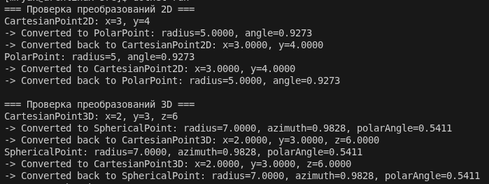
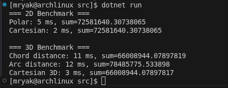

# Лабораторно-практичне заняття №1: Програмні моделі систем координат

## Короткий опис роботи
Метою роботи було спроектувати та реалізувати імутабельні програмні моделі для представлення точок у 2D та 3D системах координат, реалізувати перетворення між декартовою, полярною та сферичною системами координат, а також обчислення відстаней між точками різними способами. Було проведено аналіз продуктивності обчислень для різних представлень даних.

**Реалізовані класи:**

- [CartesianPoint3D](./src/Models/CartesianPoint2D.cs) - точка у 2D декартовій системі.
- [PolarPoint](./src/Models/PolarPoint.cs) - точка у 2D полярній системі.
- [CartesianPoint3D](./src/Models/CartesianPoint3D.cs) - точка у 3D декартовій системі.
- [SphericalPoint](./src/Models/SphericalPoint.cs) - точка у 3D сферичній системі.

Кожен клас має статичні фабричні методи для перетворення між системами координат (наприклад, `CartesianPoint2D.FromPolar(p)`).

---

## Інструкції для запуску проекту

1. Клонуйте репозиторій:
```bash
   git clone https://github.com/jigalowv/CoordinateSystemSDPW.git
   cd CoordinateSystemSDPW/lab-practice-01/src/
```

2. Впевніться, що встановлено:

   * .NET 10 SDK або новіше
   * IDE: Visual Studio 2022 / VS Code
3. Збірка проекту:

   ```bash
   dotnet build
   ```
4. Запуск програми:

   ```bash
   dotnet run
   ```
5. Перевірка результатів у консолі. Програма автоматично створює тестові точки, виконує прямі та зворотні перетворення, а також бенчмарки для 2D та 3D відстаней.

---

## Результати перевірки коректності

### Приклад тестових перетворень 2D

```
CartesianPoint2D: x=3, y=4
PolarPoint: radius=5, angle=0.9273
Converted back to CartesianPoint2D: x=3.0000000001, y=3.9999999999
```

### Приклад тестових перетворень 3D

```
CartesianPoint3D: x=2, y=3, z=4
SphericalPoint: radius=5.385, azimuth=0.9828, polarAngle=0.9273
Converted back to CartesianPoint3D: x=2.0000001, y=3.0000002, z=3.9999999
```



---

## Результати аналізу продуктивності (Бенчмаркінг)

### Виконання програми


### 2D Простір

| Підхід               | Час виконання | Сумарна відстань |
|----------------------|---------------|-----------------|
| Полярні координати    | 5 ms          | 72,581,640.31 units |
| Декартові координати  | 2 ms          | 72,581,640.31 units |

**Примітка:** сумарна відстань — це сума всіх відстаней між парами точок. Значення майже ідентичні, різниця виникає лише через погрішність обчислень з плаваючою точкою.

---

### 3D Простір

| Підхід                 | Час виконання | Сумарна відстань |
|------------------------|---------------|-----------------|
| Сферична (хорда)       | 11 ms         | 66,008,944.08 units |
| Сферична (дуга)        | 12 ms         | 78,485,775.53 units |
| Декартова               | 3 ms          | 66,008,944.08 units |

---


## Аналіз та висновки

**2D Простір:**
- Обчислення відстаней у полярних координатах повільніше через наявність тригонометричних функцій.  
- Використання декартових координат для масових обчислень більш ефективне.  

**3D Простір:**
- Декартові координати забезпечують найшвидші обчислення відстані.  
- Хордовий метод у сферичних координатах трохи повільніший.  
- Дугова відстань — найповільніший метод через складні тригонометричні обчислення.  
- Пояснення різниці сум відстаней: хорда вимірює пряму між точками, а дуга — довжину по поверхні сфери.

**Загальний висновок:**
- Було закріплено навички створення імутабельних моделей, перетворень координат та обчислення відстаней.  
- Проведено порівняння продуктивності, яке показало вплив складності формул та тригонометричних обчислень на швидкодію.