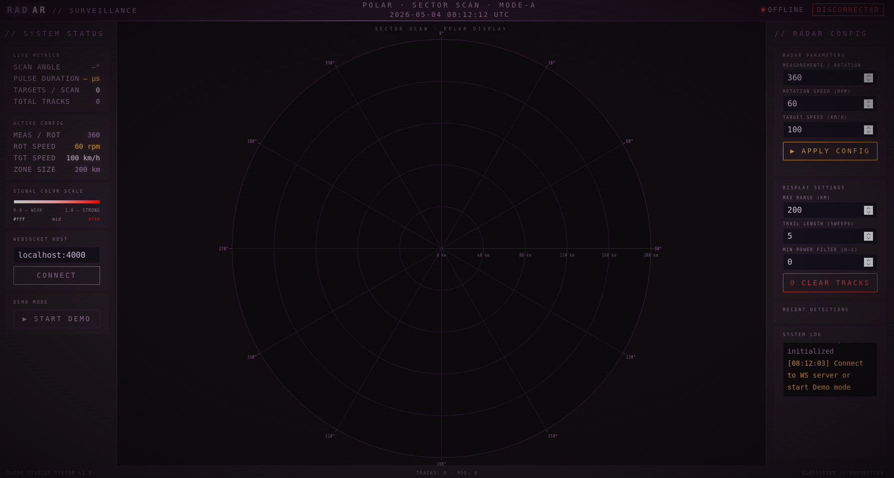
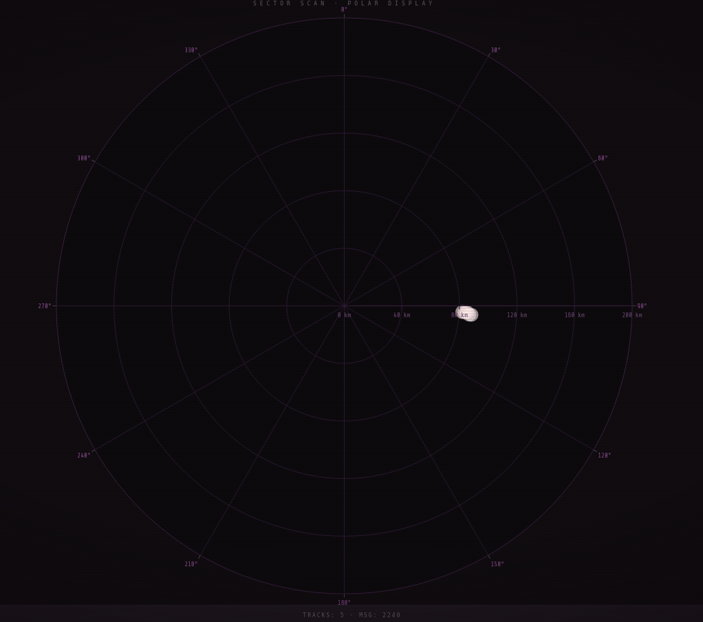
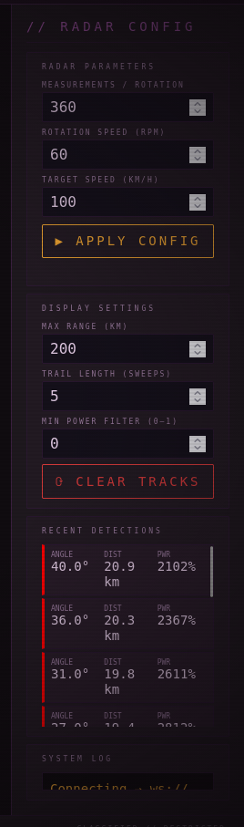

# Radar Visualization Web Application

## Опис

Цей проєкт є веб-додатком для візуалізації вимірювань радару в режимі реального часу. Додаток підключається до емулятора вимірювальної частини радару через WebSocket, обробляє отримані дані та відображає виявлені цілі на графіку в полярних координатах.

Додаток демонструє принципи визначення положення об’єктів за часом поширення сигналу та надає інтерфейс для зміни параметрів радару.

---

## Мета

* Встановлення з’єднання з емулятором через WebSocket
* Обробка вхідних даних радару
* Обчислення відстані на основі затримки сигналу
* Візуалізація цілей у полярних координатах
* Реалізація керування параметрами радару через REST API

---

## Модель даних радару

Повідомлення мають наступну структуру:

```json
{
  "scanAngle": 90,
  "pulseDuration": 1,
  "echoResponses": [
    {
      "time": 0.000012,
      "power": 0.05
    }
  ]
}
```

### Опис полів

| Поле            | Тип    | Опис                        |
| --------------- | ------ | --------------------------- |
| `scanAngle`     | number | Кут сканування (0–360°)     |
| `pulseDuration` | number | Тривалість імпульсу (мкс)   |
| `echoResponses` | array  | Масив відбитих сигналів     |
| `time`          | number | Час проходження сигналу (с) |
| `power`         | number | Потужність сигналу (0–1)    |

---

## Обчислення відстані

Відстань обчислюється за формулою:

R = (c * t) / 2

Де:

* `R` — відстань (км)
* `c` — швидкість світла (~300 000 км/с)
* `t` — час проходження сигналу (туди і назад)

---

## Функціональні можливості

* Отримання даних у реальному часі через WebSocket
* Візуалізація у полярній системі координат
* Зміна параметрів радару через API
* Відображення потужності сигналу через колір
* Безперервне оновлення даних

---

## Архітектура

```text
Radar Emulator (Docker)
        │
        ▼
   WebSocket Server
        │
        ▼
   Web Application
        │
 ┌──────┴────────┐
 │ Обробка даних │
 │ Візуалізація  │
 │ API керування │
 └───────────────┘
```

---

## Запуск проєкту

### 1. Запуск емулятора

```bash
docker pull iperekrestov/university:radar-emulation-service

docker run --name radar-emulator -p 4000:4000 iperekrestov/university:radar-emulation-service
```

---

### 2. Запуск додатку

```bash
python -m http.server 8000
```

---

### 3. Відкриття у браузері

```
http://localhost:8000/index.html
```

---

## Підключення WebSocket

```javascript
const socket = new WebSocket('ws://localhost:4000');

socket.onmessage = (event) => {
    const data = JSON.parse(event.data);
};
```

---

## Налаштування через API

### Зміна параметрів

```bash
curl -X PUT http://localhost:4000/config \\
-H "Content-Type: application/json" \\
-d '{
  "measurementsPerRotation": 360,
  "rotationSpeed": 10,
  "targetSpeed": 500
}'
```

### Параметри

| Параметр                | Опис                      |
| ----------------------- | ------------------------- |
| measurementsPerRotation | Кількість вимірювань      |
| rotationSpeed           | Швидкість обертання (RPM) |
| targetSpeed             | Швидкість цілей (км/год)  |

---

## Візуалізація

Цілі відображаються у полярних координатах:

* Кут (θ) — `scanAngle`
* Відстань (R) — обчислюється
* Інтенсивність кольору — `power`

---

## Скріншоти

### Основний інтерфейс


### Приклад графіка


### Панель налаштувань

---

## Структура проєкту

```text
src/
├── components/
├── services/
├── utils/
├── App.js
├── index.js
```

---

## Тестування

```bash
wscat -c ws://localhost:4000
```

---

## Результат

Реалізовано веб-додаток, який у реальному часі відображає дані радару, дозволяє аналізувати положення цілей та змінювати параметри системи.