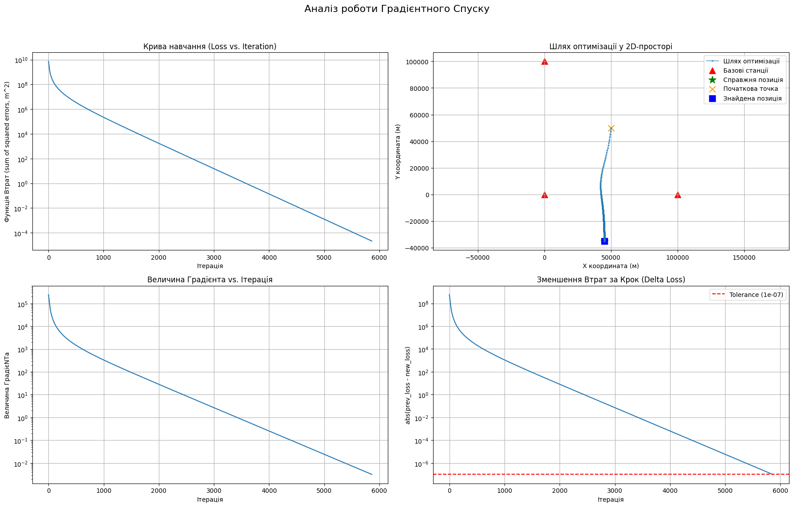
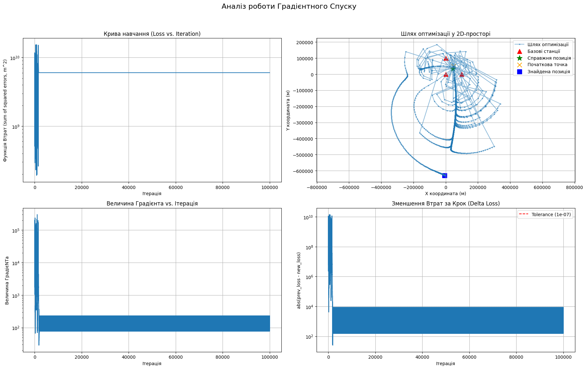
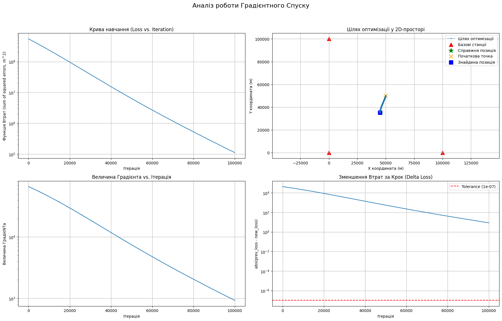
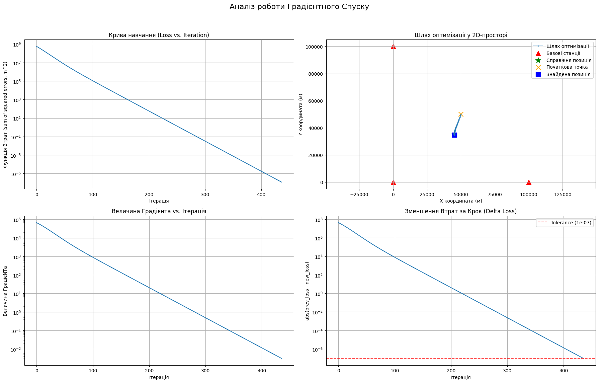

# Лабораторна робота: Дослідження градієнтного спуску для задачі TDoA

## Опис роботи

У роботі досліджується застосування методу градієнтного спуску для оцінювання координат об’єкта на основі Time Difference of Arrival (TDoA). Мета експериментів - визначити вплив шуму вимірювань, кроку навчання, початкового наближення та геометрії системи на точність і збіжність алгоритму.

---

## Завдання 1 - Контрольний запуск (ідеальний випадок)

### Вхідні параметри

- `NOISE_LEVEL` = 0  
- `LEARNING_RATE` = 0.01  
- `INITIAL_GUESS` = [50000, 50000]  
- `TRUE_POSITION` = [45000, -35000]  

### Результати

- Фінальна похибка позиціонування: ~0.01 м  
- Кількість ітерацій: 5863  

### Аналіз

Наявність ненульової похибки навіть за відсутності шуму є очікуваною поведінкою чисельного методу. Градієнтний спуск зупиняється за критерієм:

- `ΔLoss < TOLERANCE = 1e-7`

Це означає, що алгоритм завершує роботу не в точному аналітичному мінімумі, а в його околі.

Зменшення градієнта та стабілізація значення функції втрат підтверджують коректну збіжність.

---

## Завдання 2 - Дослідження `learning_rate`

### Вхідні параметри

- `NOISE_LEVEL` = 1e-6  

---

### 2a - `LEARNING_RATE = 2.0`

#### Результат

- Збіжність відсутня  

#### Аналіз

Спостерігається розбіжність алгоритму: значення функції втрат коливається або зростає.

Причина - надто великий крок градієнтного спуску, через що алгоритм "перестрибує" мінімум і не може стабілізуватися.

---

### 2b - `LEARNING_RATE = 1e-5`

#### Результат

- Збіжність не досягнута за `MAX_ITERATIONS`

#### Аналіз

Алгоритм рухається в правильному напрямку, але надто повільно.

Це класичний випадок стагнації: крок настільки малий, що зменшення функції втрат відбувається практично непомітно в межах ліміту ітерацій.

---

### 2c - `LEARNING_RATE = 0.01`

#### Результат

- Швидка та стабільна збіжність  

#### Висновок по завданню

Параметр `learning_rate` визначає баланс між стабільністю та швидкістю:

- занадто великий - розбіжність  
- занадто малий - повільна збіжність  
- оптимальний - ефективна мінімізація  

---

## Завдання 3 - Вплив `NOISE_LEVEL`

### Вхідні параметри

- `LEARNING_RATE` = 0.01  

### Результати

| `NOISE_LEVEL (σ)` | Оцінений шум (м) | Фінальна похибка (м) |
|------------------|------------------|----------------------|
| 1e-9             | ~0.3             | 0.49                 |
| 1e-6             | ~300             | 199.44               |
| 1e-4             | ~30000           | 13383.57             |

### Аналіз (уточнений)

Спостерігається монотонне зростання похибки зі збільшенням рівня шуму. Це підтверджує, що точність оцінки координат у TDoA безпосередньо обмежується якістю вхідних даних.

Важливе уточнення: значення "оціненого шуму в метрах" є результатом масштабування моделі і не є фізичною конверсією σ у метри в строгому сенсі, а відображає вплив шуму на часові різниці та геометричну реконструкцію координат.

Алгоритм у всіх випадках формально збігається, однак мінімізує вже спотворену функцію втрат. Тому при високому шумі мінімум функції суттєво зміщується від істинного положення.

---

## Завдання 4 - Вплив `INITIAL_GUESS`

### Вхідні параметри

- `NOISE_LEVEL` = 1e-6  

### Результати

| Початкова точка    | Ітерації | Похибка (м) |
|--------------------|----------|-------------|
| [50000, 50000]     | 433      | 283.42      |
| [0, 0]             | 365      | 123.87      |
| [-500000, -500000] | 56996    | 957172.77   |

### Аналіз

Початкове наближення суттєво впливає на швидкість збіжності.

- Ближчі стартові точки - швидша та стабільніша оптимізація  
- Віддалені стартові точки - різке збільшення ітерацій і деградація точності  

Причина полягає в нелінійності функції втрат TDoA. У віддалених областях простору градієнт може ставати погано обумовленим, що призводить до неефективної траєкторії спуску.

Також можливі ефекти проходження через ділянки з малим градієнтом (plateau regions), де оптимізація сповільнюється.

---

## Завдання 5 - Вплив геометрії (GDOP)

### Вхідні параметри

- `NOISE_LEVEL` = 1e-6  

#### 5a - Хороша геометрія
- `TRUE_POSITION` = [45000, 35000]

#### 5b - Погана геометрія
- `TRUE_POSITION` = [45000, -135000]

### Результати

- 5a похибка: 170.71 м  
- 5b похибка: 9281.24 м  

### Аналіз

Геометрія системи суттєво впливає на стійкість оцінки.

При хорошій геометрії гіперболи перетину мають більш "ортогональну" структуру, що забезпечує стабільне рішення.

При поганій геометрії виникає ефект GDOP (Geometric Dilution of Precision):  
лінії положення стають майже паралельними, і навіть малий шум призводить до великої похибки.

Алгоритм при цьому формально збігається, але до "плоского" мінімуму, який геометрично далеко від істинного значення.

---

## Загальний висновок

У ході роботи встановлено:

- Найбільш критичним фактором точності є рівень шуму вимірювань  
- Геометрія системи (GDOP) визначає принципову обмеженість точності  
- Параметр `learning_rate` контролює стабільність і швидкість збіжності  
- Початкове наближення впливає переважно на швидкість збіжності та чисельну стабільність  
- Критерій зупинки визначає компроміс між точністю та обчислювальною вартістю  

Градієнтний спуск є коректним методом для задачі TDoA, однак його ефективність суттєво залежить від якості даних та умов оптимізації. У практичних системах це вимагає контролю шуму, геометрії сенсорів і адаптивного налаштування гіперпараметрів.