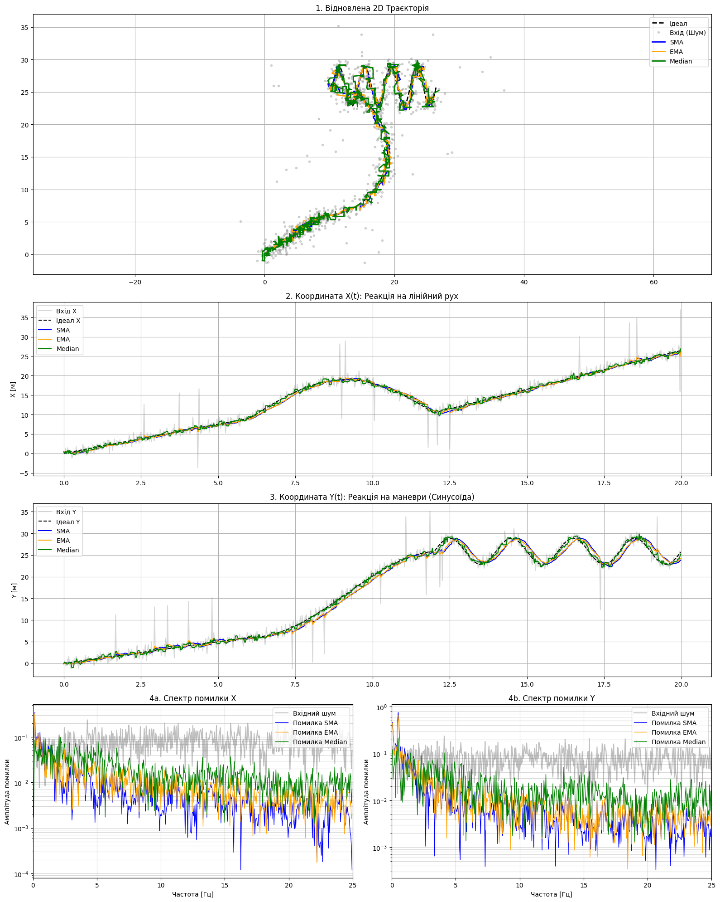

# Лабораторна робота №5  
## Обробка координатних даних: придушення шумів у потоці (Real-time)

**Студент: Жигальов В.О.**  
**Група: ІПЗ 4.02**  

---

# 1. Мета роботи

Дослідити роботу цифрових фільтрів SMA, EMA та Median у режимі реального часу та оцінити вплив параметрів на якість згладжування і затримку сигналу.

---

# 2. Реалізація

Було реалізовано методи оновлення для трьох фільтрів.

## SMA

```python
def update(self, x):
    if len(self.q) == self.w:
        self.sum -= self.q[0]
    self.q.append(x)
    self.sum += x
    return self.sum / len(self.q)
```

## EMA

```python
def update(self, x):
    if self.last is None:
        self.last = x
    else:
        self.last = self.a * x + (1 - self.a) * self.last
    return self.last
```

## Median

```python
def update(self, x):
    self.q.append(x)
    return np.median(self.q)
```

---

# 3. Експеримент 1 - Базовий режим

Параметри: `W_SMA = 20`, `A_EMA = 0.1`, `W_MED = 21`.

### Результат


### Аналіз

SMA добре згладжує шум, але створює помітну затримку. EMA реагує швидше та дає більш природну траєкторію. Median ефективно усуває викиди, але сигнал виглядає менш гладким.

У динамічних ділянках всі фільтри відстають від реального сигналу, особливо SMA. Median зберігає форму руху, але має ступінчастість. При наявності викидів саме Median показує найкращий результат, тоді як SMA і EMA розподіляють їх у часі.

---

# 4. Експеримент 2 - Надмірне згладжування

Параметри: `W_SMA = 100`, `A_EMA = 0.02`.

### Результат


### Аналіз

При збільшенні згладжування шум значно зменшується, однак зростає помилка на низьких частотах. Це пов’язано із затримкою фільтра та викривленням форми сигналу - повороти згладжуються, а траєкторія запізнюється.

Таким чином, загальна помилка визначається двома складовими: залишковим шумом і спотворенням сигналу. При сильному фільтруванні перша зменшується, але друга зростає.

---

# 5. Експеримент 3 - Median (мале вікно)

Параметр: `W_MED = 5`.

### Результат



### Аналіз

Median з малим вікном добре прибирає одиночні викиди, але гірше працює при їх серіях. У порівнянні з SMA сигнал менш гладкий, проте краще захищений від імпульсного шуму.

---

# 6. Висновок

У ході роботи було досліджено три методи фільтрації координатних даних у потоковому режимі.

SMA забезпечує якісне згладжування, але створює значну затримку. EMA є більш збалансованим варіантом і краще підходить для реального часу. Median ефективний для усунення викидів, проте не формує гладкий сигнал.

Основний результат полягає в тому, що підвищення ступеня згладжування зменшує шум, але неминуче призводить до затримки та викривлення сигналу.