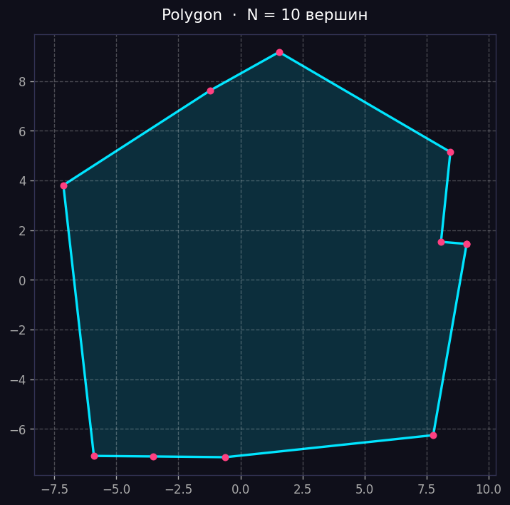
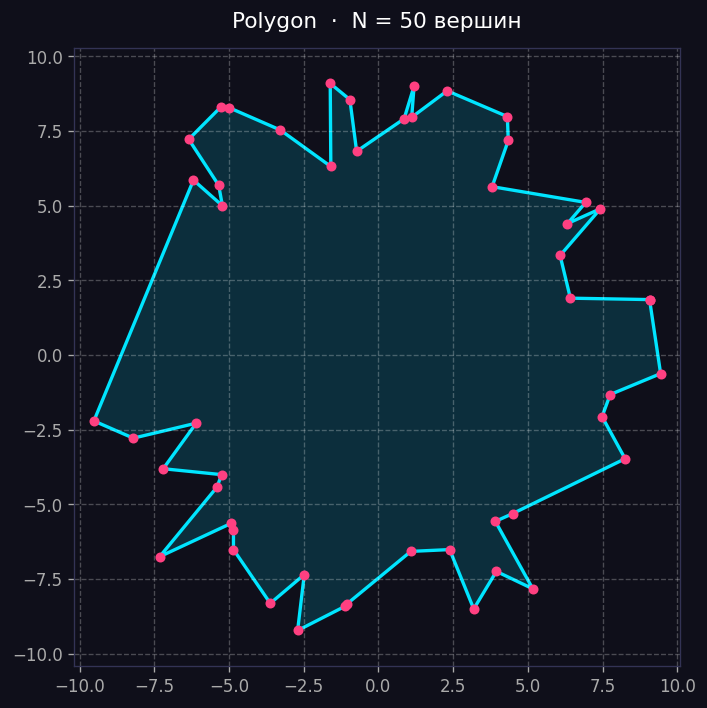
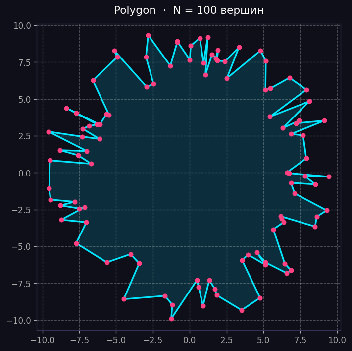
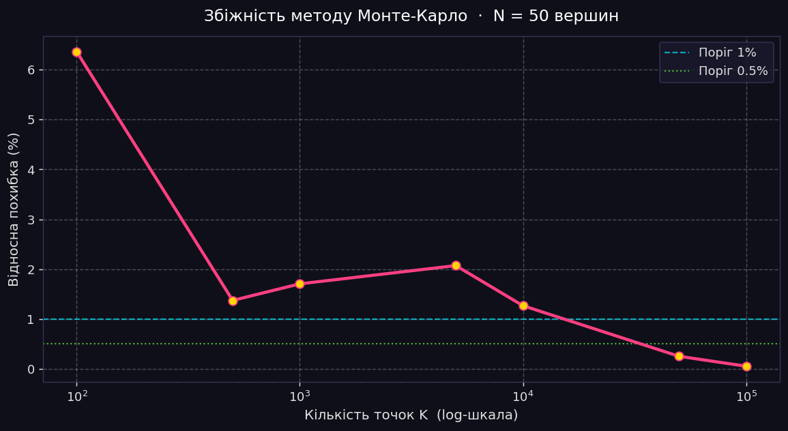
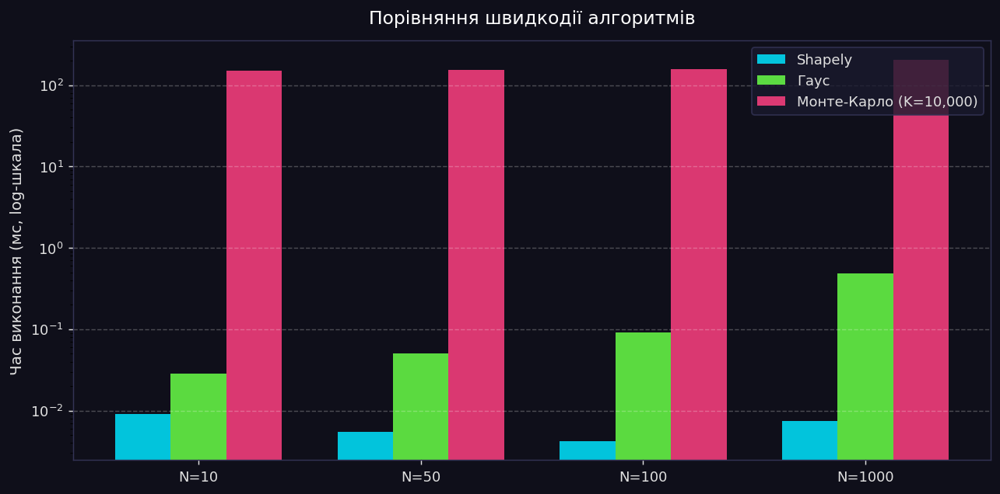

# Лабораторна робота №6 — Обчислення площі полігонів

> **Алгоритмічні та евристичні методи обчислення площі геометричних фігур**

---

## Зміст

1. [Опис методів](#опис-методів)
2. [Структура проекту](#структура-проекту)
3. [Встановлення та запуск](#встановлення-та-запуск)
4. [Результати](#результати)
5. [Висновки](#висновки)

---

## Опис методів

### 🔷 Shapely (еталон / Ground Truth)
Бібліотека Shapely використовує оптимізовані C++-реалізації геометричних алгоритмів (на базі GEOS). Значення `polygon.area` є еталонним і використовується для обчислення відносної похибки інших методів.

### 🔶 Метод Гауса (Shoelace formula)
Аналітичний метод обчислення площі простого багатокутника:

$$S = \frac{1}{2} \left| \sum_{i=0}^{n-1} (x_i \cdot y_{i+1} - x_{i+1} \cdot y_i) \right|$$

- **Точність**: абсолютно точний (аналітичний)
- **Складність**: O(n), де n — кількість вершин

### 🔴 Метод Монте-Карло
Імовірнісний метод на основі випадкової вибірки:

1. Визначити Bounding Box полігону: `(min_x, min_y, max_x, max_y)`
2. Згенерувати K випадкових точок всередині BB
3. Порахувати кількість точок `M`, що потрапили всередину полігону
4. Площа ≈ `S_bb × (M / K)`

$$S \approx S_{BB} \cdot \frac{M_{in}}{K}$$

- **Точність**: зростає зі збільшенням K
- **Складність**: O(K)

---

## Структура проекту

```
lab-polygon-area/
│
├── src/
│   ├── main.py          # Головний скрипт (запускати цей файл)
│   ├── generators.py    # Генерація та візуалізація полігонів
│   └── algorithms.py    # Реалізація методів Гауса і Монте-Карло
│
├── images/
│   ├── polygon_n10.png      # Полігон з 10 вершинами
│   ├── polygon_n50.png      # Полігон з 50 вершинами
│   ├── polygon_n100.png     # Полігон зі 100 вершинами
│   ├── error_plot.png       # Графік збіжності Монте-Карло
│   └── time_benchmark.png   # Графік бенчмарку
│
├── requirements.txt
├── .gitignore
└── README.md
```

---

## Встановлення та запуск

### Крок 1 — Клонувати репозиторій
```bash
git clone https://github.com/YOUR_USERNAME/lab-polygon-area.git
cd lab-polygon-area
```

### Крок 2 — Створити віртуальне оточення
```bash
# Windows
python -m venv .venv
.venv\Scripts\activate

# Linux / macOS
python3 -m venv .venv
source .venv/bin/activate
```

### Крок 3 — Встановити залежності
```bash
pip install -r requirements.txt
```

### Крок 4 — Запустити головний скрипт
```bash
cd src
python main.py
```

Після запуску в папці `images/` з'являться всі графіки та зображення полігонів.

---

## Результати

### Згенеровані полігони

| N = 10 вершин | N = 50 вершин | N = 100 вершин |
|:---:|:---:|:---:|
|  |  |  |

---

### Графік збіжності методу Монте-Карло (N = 50)



| K (точок) | Площа MC | Похибка (%) |
|----------:|----------:|------------:|
| 100       | 222.3089  | 6.3596%     |
| 500       | 211.8882  | 1.3740%     |
| 1 000     | 212.5829  | 1.7064%     |
| 5 000     | 213.3471  | 2.0720%     |
| 10 000    | 206.3652  | 1.2684%     |
| 50 000    | 208.4841  | 0.2546%     |
| 100 000   | 208.9009  | 0.0552%     |

> Еталонна площа (Shapely): **209.016336**

---

### Таблиця бенчмарку продуктивності



| Кількість вершин | Shapely (мс) | Гаус (мс) | Монте-Карло K=10k (мс) |
|-----------------:|-------------:|----------:|-----------------------:|
| 10               | 0.0091       | 0.0286    | 151.71                 |
| 50               | 0.0054       | 0.0501    | 152.88                 |
| 100              | 0.0042       | 0.0905    | 157.43                 |
| 1000             | 0.0074       | 0.4822    | 205.95                 |

---

## Висновки

### Швидкість: Гаус vs Монте-Карло
Метод Гауса є **на 3–4 порядки швидшим** за Монте-Карло при K = 10 000. Навіть для полігону з 1000 вершин Гаус виконується за 0.48 мс, тоді як Монте-Карло потребує ~206 мс. Це пояснюється тим, що Гаус робить рівно N операцій, тоді як Монте-Карло — K перевірок входження точки.

### Точність Монте-Карло: скільки ітерацій достатньо?
| Рівень точності | Мінімальна K |
|:----------------|:-------------|
| < 5% похибки    | ~500         |
| < 2% похибки    | ~1 000       |
| < 1% похибки    | ~10 000      |
| < 0.3% похибки  | ~50 000      |
| < 0.1% похибки  | ~100 000     |

Для **інженерних задач** (похибка ≤ 1%) достатньо **K = 10 000** точок. Для наукових задач з точністю < 0.1% потрібно K ≥ 100 000.

### Загальний висновок
- **Метод Гауса** — оптимальний вибір для практичних задач: абсолютно точний, O(n), миттєвий.
- **Метод Монте-Карло** — доцільний лише тоді, коли аналітичне рішення неможливе (складні криволінійні фігури, фігури без аналітичного опису).
- **Shapely** — зручний інструмент для верифікації та роботи з геометрією, але приховує деталі реалізації.
